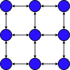

# Maze generator lib

Customizable maze generator library based on graphs.

The main concept in this library is Generator. It is designed to be customizable for different maze shapes(rectangular,
hexagonal, etc.)

NaiveGenerator is the only one implementation of a Generator available.

## Naive generator

Generation process:

1. Create adjacency matrix for desired graph type and size. The graph represented by the matrix will look like this (
   rectangular type, 3x3 size):

   

2. Create list of nodes, make each node aware of its neighbors according to the matrix from step 1.

3. Select entrance node and add it to the list of `visited nodes`.

4. For each node in the list of `visited nodes` check if it has not connected neighbors. All nodes that satisfy filter
   criteria are placed in `possible to visit` list.

5. If `possible to visit` list contains nodes do steps 6 - 10, else go to step 11.

6. Select node to visit from the `possible to visit` list.

7. Make list of `unvisited neighbors` for the selected node.

8. Select node from `unvisited neighbors` and make connection to it. Add connected neighbor to the `visited nodes` list.

9. Check if node selected on step 6 has not connected neighbors. If no unconnected neighbors left, remove node
   from `visited nodes` list.

10. Go to step 4.

11. Select exit node.

## Prerequisites

To start maze generation one has to decide on each of the following things.

* How entrance and exit for the maze will be selected.
* How graph adjacency matrix will be generated.
* How next node on each step will be selected.

## Create and use Generator

There are multiple ways to create Generator object:

1. Use available Director

```
var builder = new GeneratorBuilder(NaiveGenerator::new);
var director = new RectGeneratorDirector(builder);
var generator = director.centersAndRandomNodeSelector(3, 3, 1L);
```

2. Use GeneratorBuilder

```
var generator = new GeneratorBuilder(NaiveGenerator::new)
                .withAdjMatrixGenerator(new RectAdjacencyMatrixGenerator(width, height))
                .withMazeSupplier(() -> new RectMaze(width, height))
                .withNodeSelector(new RandomNodeSelector())
                .withEntranceSelector(new CenterEntranceSelector(width, height, true))
                .withExitSelector(new CenterEntranceSelector(width, height, false))
                .build();
```

3. Init available Generator directly

```
var generator = new NaiveGenerator();
generator.setMatrixGenerator(new RectAdjacencyMatrixGenerator(width, height));
generator.setMazeSupplier(() -> new RectMaze(width, height));
generator.setNodeSelector(new RandomNodeSelector(1L));
generator.setEntranceSelector(new CenterEntranceSelector(width, height, true));
generator.setExitSelector(CenterEntranceSelector(width, height, false));
```

Use Generator by calling `generateMaze()` method on it.

## Goodies

### Write a maze to String

ToStringVisitor can be used to create a String with the maze. It relies on box drawing Unicode characters so make sure
output destination supports UTF-8.

Only rectangular mazes supported for now.

Here's how to write a maze in the console.

```
var maze; // assign some value
var visitor = new ToStringVisitor();
maze.acceptVisitor(visitor);
System.out.println(visitor.getScreenView());
```

Output example

```
┌ ┬─┬─┬─┐
|     | |
├ ┼─┼─┼ ┤
|       |
├ ┼─┼─┼─┤
|   |   |
├ ┼─┼ ┼ ┤
|     | |
└─┴─┴─┴ ┘
```

## License

This project is release under [MIT license](LICENSE)